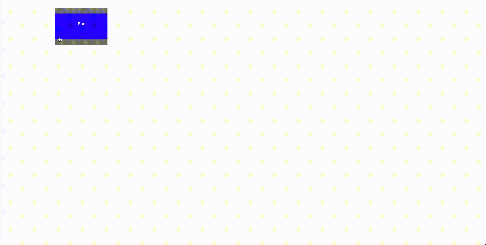

# Draggable Box

Simple draggable box built with React without using any third party library.

The user can drag and hold the box on the corner (top & bottom) to move it around.
Releasing it changes its position.

### Set-up

`npm install`

`npm start`

Open [http://localhost:3000](http://localhost:3000) to view it in your browser.

